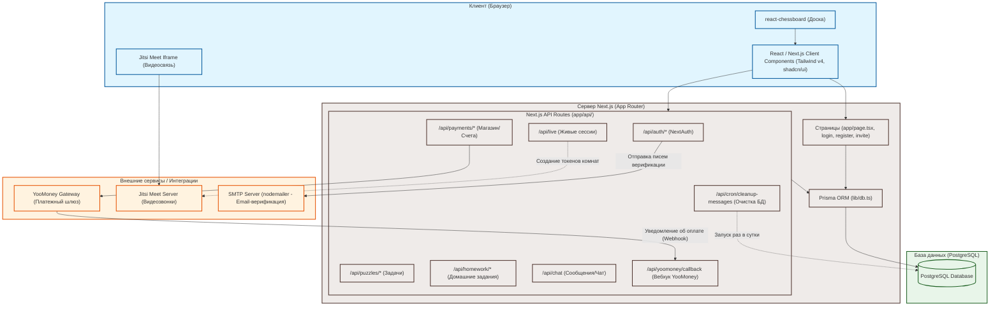

# Схема архитектуры проекта "64 линии"

Данный документ содержит Mermaid-диаграмму взаимодействия всех слоев приложения на верхнем уровне.

## Диаграмма взаимодействия

## Описание потоков данных

1. **Пользовательские действия**: Браузер загружает [[Главная-page]] (рендерит компонент [[teacher-hub]]) и отправляет запросы к [[00-Индекс-API|API эндпоинтам]].
2. **Шахматная логика**: На доске [[LiveLessonBoard]] и [[Puzzles]] ходы обрабатываются локально через `chess.js`, а затем передаются на сервер для валидации и сохранения.
3. **Оплата**: При покупке курса создается запись [[Model-Purchase]] (PENDING). Пользователь перенаправляется на YooMoney. После успешной транзакции YooMoney отправляет запрос на [[API-Payments-and-YooMoney]] (конкретно эндпоинт `yoomoney/callback`), который верифицирует SHA-1 хэш и активирует доступ/премиум статус [[Model-User]].
4. **Онлайн-занятия**: Тренер и ученик синхронизируют ходы на [[LiveLessonBoard]] через периодический опрос API [[API-Live-Lessons]] (long-polling/polling), а параллельно открывается Jitsi-звонок.
