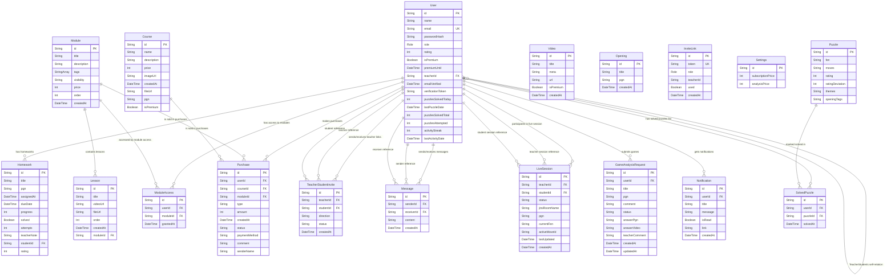

# ER-Диаграмма базы данных проекта "64 линии"

В диаграмме ниже показаны все таблицы, генерируемые через Prisma, их поля и связи «один-ко-многим» и «многие-к-многим».

## Схема связей (Mermaid)

```mermaid
erDiagram
    User {
        String id PK
        String name
        String email UK
        String passwordHash
        Role role
        Int rating
        Boolean isPremium
        DateTime premiumUntil
        String teacherId FK
        DateTime emailVerified
        String verificationToken
        Int puzzlesSolvedToday
        DateTime lastPuzzleDate
        Int puzzlesSolvedTotal
        Int puzzlesAttempted
        Int activityStreak
        DateTime lastActivityDate
    }

    Homework {
        String id PK
        String title
        String pgn
        DateTime assignedAt
        DateTime dueDate
        Int progress
        Boolean solved
        Int attempts
        String teacherNote
        String studentId FK
        Int rating
    }

    Course {
        String id PK
        String name
        String description
        Int price
        String imageUrl
        DateTime createdAt
        String fileUrl
        String pgn
        Boolean isPremium
    }

    Module {
        String id PK
        String title
        String description
        StringArray tags
        String visibility
        Int price
        Int order
        DateTime createdAt
    }

    Lesson {
        String id PK
        String title
        String videoUrl
        String fileUrl
        Int order
        DateTime createdAt
        String moduleId FK
    }

    ModuleAccess {
        String id PK
        String userId FK
        String moduleId FK
        DateTime grantedAt
    }

    Purchase {
        String id PK
        String userId FK
        String courseId FK
        String moduleId FK
        String type
        Int amount
        DateTime createdAt
        String status
        String paymentMethod
        String comment
        String senderName
    }

    Video {
        String id PK
        String title
        String meta
        String url
        Boolean isPremium
        DateTime createdAt
    }

    Opening {
        String id PK
        String title
        String pgn
        DateTime createdAt
    }

    InviteLink {
        String id PK
        String token UK
        Role role
        String teacherId
        Boolean used
        DateTime createdAt
    }

    TeacherStudentInvite {
        String id PK
        String teacherId FK
        String studentId FK
        String direction
        String status
        DateTime createdAt
    }

    Message {
        String id PK
        String senderId FK
        String receiverId FK
        String content
        DateTime createdAt
    }

    LiveSession {
        String id PK
        String teacherId FK
        String studentId FK
        String status
        String jitsiRoomName
        String pgn
        String currentFen
        String activeMoveId
        DateTime lastUpdated
        DateTime createdAt
    }

    Settings {
        String id PK
        Int subscriptionPrice
        Int analysisPrice
    }

    GameAnalysisRequest {
        String id PK
        String userId FK
        String title
        String pgn
        String comment
        String status
        String answerPgn
        String answerVideo
        String teacherComment
        DateTime createdAt
        DateTime updatedAt
    }

    Puzzle {
        String id PK
        String fen
        String moves
        Int rating
        Int ratingDeviation
        String themes
        String openingTags
    }

    Notification {
        String id PK
        String userId FK
        String title
        String message
        Boolean isRead
        String link
        DateTime createdAt
    }

    SolvedPuzzle {
        String id PK
        String userId FK
        String puzzleId FK
        DateTime solvedAt
    }

    %% Отношения
    User ||--o{ Homework : "has homeworks"
    User ||--o{ ModuleAccess : "has access to modules"
    User ||--o{ Purchase : "makes purchases"
    User ||--o{ GameAnalysisRequest : "submits games"
    User }o--o| User : "TeacherStudents self-relation"
    User ||--o{ Message : "sends/receives messages"
    User ||--o{ LiveSession : "participates in live session"
    User ||--o{ TeacherStudentInvite : "sends/receives teacher links"
    User ||--o{ Notification : "gets notifications"
    User ||--o{ SolvedPuzzle : "has solved puzzles list"
    
    Module ||--o{ Lesson : "contains lessons"
    Module ||--o{ ModuleAccess : "accessed by module access"
    Module ||--o{ Purchase : "is sold in purchases"
    
    Course ||--o{ Purchase : "is sold in purchases"
    
    Puzzle ||--o{ SolvedPuzzle : "marked solved in"
    
    TeacherStudentInvite }o--|| User : "teacher reference"
    TeacherStudentInvite }o--|| User : "student reference"
    
    LiveSession }o--|| User : "teacher session reference"
    LiveSession }o--|| User : "student session reference"
    
    Message }o--|| User : "sender reference"
    Message }o--|| User : "receiver reference"
```
