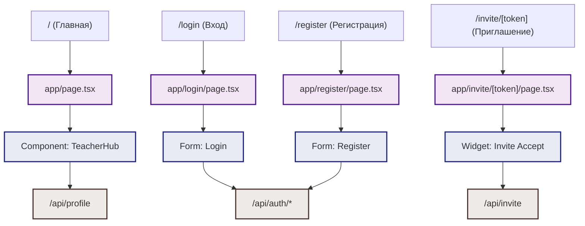

# Карта страниц и маршрутов (App Router)

Ниже представлена схема переходов по страницам приложения и подключаемые к ним клиентские компоненты и API эндпоинты.

## Граф маршрутизации (Mermaid)

## Описание маршрутов

1. **Главная страница `/`**: Единая точка входа. Если пользователь авторизован, рендерит [[teacher-hub|Личный кабинет (TeacherHub)]]. Если нет — отображает интерфейс в роли "Гость" (с предложением войти или зарегистрироваться, доступ к тактическим задачам ограничен).
2. **Вход `/login`**: Форма авторизации (email/password). После успешного входа перенаправляет на `/`.
3. **Регистрация `/register`**: Форма создания аккаунта.
4. **Реферальный инвайт `/invite/[token]`**: Специальная страница для быстрого добавления учеников. При переходе по ссылке система распознает токен [[Model-InviteLink]], автоматически привязывает ученика к тренеру и регистрирует его.
