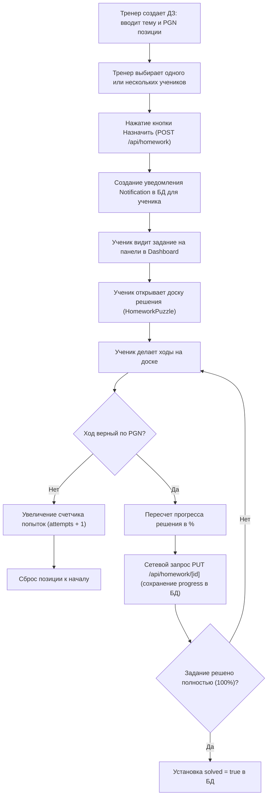

# Бизнес-процесс: Выполнение домашних заданий

Этот процесс описывает жизненный цикл домашнего задания в шахматной школе — от создания урока тренером до отправки решения учеником.

---

## 🏃 Жизненный цикл ДЗ (Workflow)

---

## ♟️ Шахматная логика в домашнем задании
- Задание хранится в формате PGN (Portable Game Notation). Он содержит не просто одну картинку позиции, а целое дерево ходов с комментариями.
- При загрузке в компонент `HomeworkPuzzle` парсер строит интерактивное дерево ходов. Ученик должен воспроизвести главный вариант (или один из правильных побочных вариантов), прописанных тренером.
- Тренер видит прогресс каждого ученика в реальном времени на вкладке **Students** в [[teacher-hub|Личном Кабинете]].

---

## 🔗 Связанные разделы
- Схема данных ДЗ: [[Model-Homework]].
- API роуты ДЗ: [[API-Homework]].
