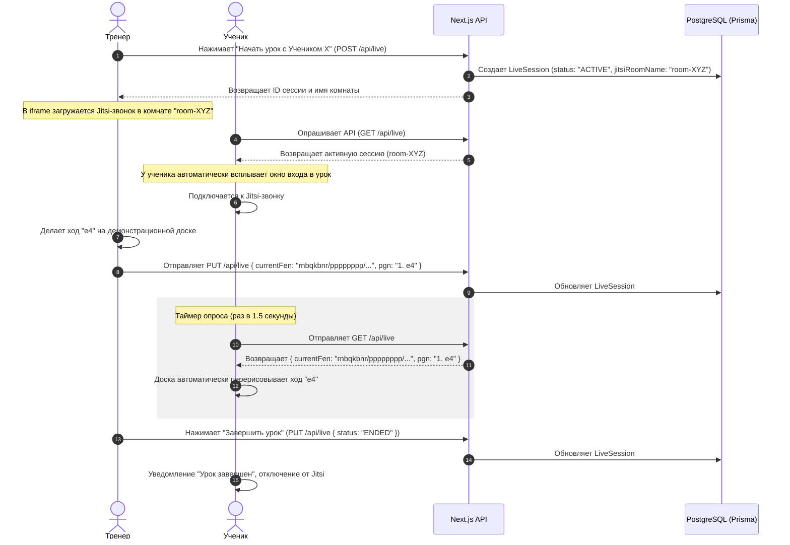

# Бизнес-процесс: Проведение Живого Урока (Live Session)

Интерактивный живой урок позволяет тренеру проводить индивидуальные или групповые занятия прямо на платформе.

---

## 🏃 Процесс инициализации и синхронизации урока

---

## ⚙️ Особенности Jitsi и доски
- Видеосвязь вставляется через официальный скрипт `https://8x8.vc/external_api.js` (бесплатный публичный сервер Jitsi Meet).
- Для стабильности шахматная доска не передает видеопоток, а шлет только текстовые строки FEN. Это гарантирует бесперебойную работу доски даже на медленном 3G-интернете.

---

## 🔗 Связанные разделы
- Компонент класса: [[LiveLessonBoard]].
- API управления сессиями: [[API-Live-Lessons]].
