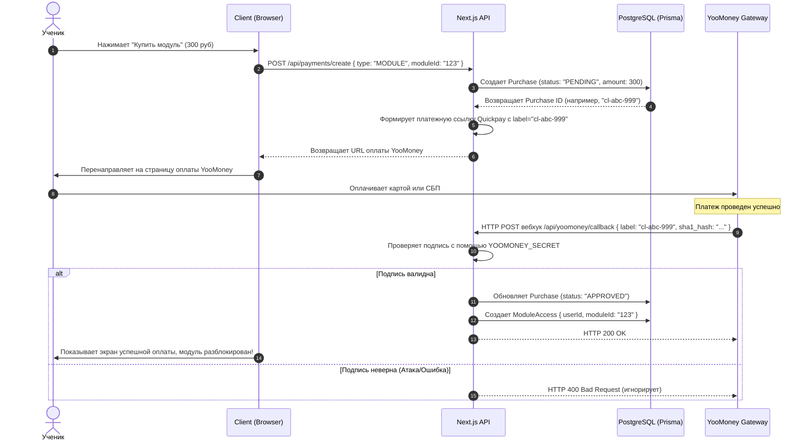

# Бизнес-процесс: Покупка курса или модуля через YooMoney

Этот процесс описывает шаги, которые проходит пользователь от клика по кнопке "Купить" на сайте до автоматического предоставления доступа к контенту после оплаты через эквайринг YooMoney.

---

## 🏃 Схема прохождения платежа (Flowchart)

---

## 🛠️ Механизмы безопасности и подпись
1. **Проверка SHA-1**: YooMoney отправляет параметры платежа (`notification_type`, `operation_id`, `amount`, `currency`, `datetime`, `sender`, `codepro`, `notification_secret`, `label`). Наш сервер вычисляет SHA-1 хэш строки, склеенной из этих параметров, используя наш секрет `YOOMONEY_SECRET`. Сравнение хэшей предотвращает подделку запросов.
2. **Ручная модерация**: Если автоматический вебхук не сработал (например, упала сеть), администратор может открыть панель **Sales** в кабинете [[teacher-hub|Личного кабинета (раздел Sales)]] и нажать кнопку **"Одобрить вручную"**. Это вызовет POST на `/api/payments/approve`, который выполнит те же действия по разблокировке контента в БД.

---

## 🔗 Связанные разделы
- Спецификация API: [[API-Payments-and-YooMoney]].
- Тестовый скрипт для локальной отладки: [[00-Индекс-скриптов|test-yoomoney-webhook.js]].
