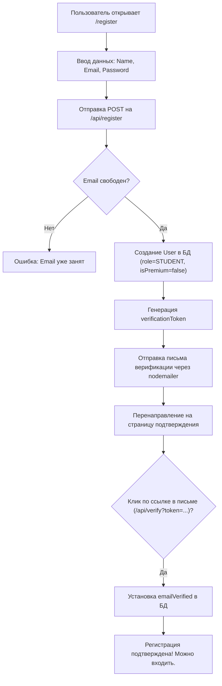

# Бизнес-процесс: Регистрация и Разделение доступа

Данный процесс описывает, как пользователи создают учетные записи, подтверждают их и как разграничиваются их права в приложении в зависимости от Premium-статуса и роли.

---

## 🏃 Флоу регистрации пользователя

---

## 🔒 Различия уровней доступа (Free vs Premium)

Для роли **STUDENT** наличие флага `isPremium = true` в таблице [[Model-User]] существенно расширяет возможности использования платформы:

| Функция / Раздел | Free-аккаунт (Обычный) | Premium-аккаунт |
|---|---|---|
| **Решение тактики ([[Puzzles]])** | Лимит 5 решенных задач в день | Безлимитное решение задач |
| **История сообщений чата ([[ChatComponent]])**| Доступны сообщения только за последние 30 дней | Полная история сообщений без лимитов |
| **Видеоматериалы ([[Model-Video]])** | Доступны только видео с `isPremium = false` | Доступ к закрытым видеолекциям |
| **Домашние задания ([[Model-Homework]])** | Выполнение заданий от тренера | Выполнение заданий от тренера |
| **Живые уроки ([[LiveLessonBoard]])** | Участие в назначенных уроках | Участие в назначенных уроках |
| **Анализ партий тренером** | Платная услуга (разовый платеж за партию) | 1-2 разбора включены (в зависимости от настроек) |

---

## 🔗 Связанные заметки и файлы
- Техническая реализация авторизации: [[NextAuth]].
- API регистрации: [[API-Auth]].
- Почтовые отправки: [[Почта-nodemailer]].
