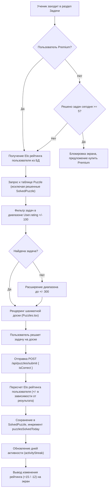

# Бизнес-процесс: Решение тактических задач

Интерактивный тренажер тактики автоматически подбирает шахматные задачи под уровень игры ученика и отслеживает рост его шахматной силы по рейтингу Elo.

---

## 🏃 Алгоритм подбора и фиксации задачи

---

## 📈 Elo рейтинг
- Используется классическая формула шахматного рейтинга с коэффициентом K=32.
- Шанс на победу (математическое ожидание E) рассчитывается как:
  $$E = rac{1}{1 + 10^{(R_{puzzle} - R_{user}) / 400}}$$
- Изменение рейтинга пользователя:
  $$Delta R = K cdot (S - E)$$
  где $S = 1$ при правильном решении, и $S = 0$ при ошибке.

---

## 🔗 Связанные разделы
- API эндпоинты задач: [[API-Puzzles]].
- UI-компонент решения: [[Puzzles]].
- Модели хранения задач: [[Model-Puzzle]], [[Model-SolvedPuzzle]].
