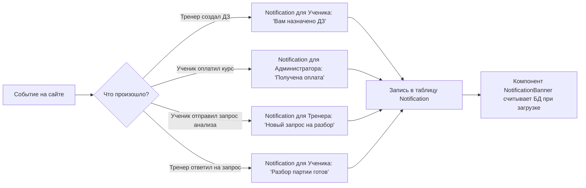

# Бизнес-процесс: Система уведомлений и Чат

Обмен сообщениями и доставка важных системных оповещений обеспечивают коммуникацию между учениками и тренерами шахматной школы.

---

## 🏃 Сценарии отправки сообщений и уведомлений

### 1. Текстовый чат (Direct Messages)
- Тренер и ученик отправляют сообщения через [[ChatComponent]].
- Каждые 2 секунды клиент опрашивает `/api/chat?with=id` для синхронизации новых сообщений.
- Чат не использует WebSockets для упрощения архитектуры и возможности запуска на простых хостингах.

### 2. Генерация Системных Уведомлений
Уведомления [[Model-Notification]] создаются автоматически триггерами на бэкенде при ключевых событиях:

---

## 🔗 Связанные разделы
- Модель уведомлений: [[Model-Notification]].
- API эндпоинты: [[API-Chat-and-Notifications]].
- Компонент отображения: [[NotificationBanner]].
